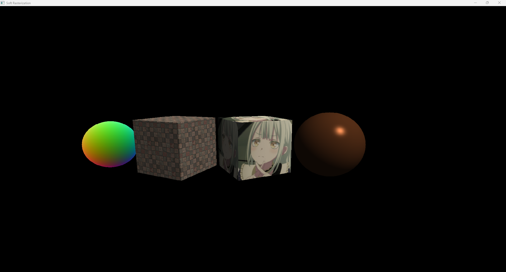
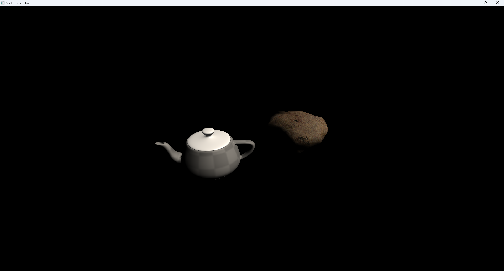

# TDSG CPU 光栅化渲染器

这是一个使用 C++20 编写的软件光栅化渲染器。项目在 CPU 侧完成主要渲染流程，并通过一个很薄的 GLFW/OpenGL 显示层把 CPU framebuffer 上传到窗口中显示（未来如果能优化的好的话应该能做到在 CPU 侧实时渲染）。

## 预览


## 构建

依赖：

- CMake 3.16 或更高版本
- 支持 C++20 的编译器
- 已初始化 Git submodule

配置并构建：

```powershell
git clone https://github.com/TDS-Graphics/TDSGRaster-CPU.git
git submodule update --init --recursive
cmake -S . -B build
cmake --build build
```

运行：

```powershell
.\build\soft_rasterization
```

如果使用多配置生成器，可执行文件可能位于 `build\Debug` 或 `build\Release` 目录下。

## 渲染流程

每一帧大致按下面的流程执行：

1. `SceneRenderer` 从场景中收集 Entity，生成 `FrameData`
2. `Renderer` 调用每个 Entity 所绑定 Shader 的 `vertex()`
3. 顶点从 clip space 投影到 screen space
4. 对三角形进行光栅化
5. 对数据进行透视正确插值
6. 调用 Entity 所绑定 Shader 的 `fragment()` 计算最终颜色
7. 如果通过深度测试，则写入 framebuffer。
8. 将 CPU framebuffer 上传为 OpenGL texture，并显示到窗口

